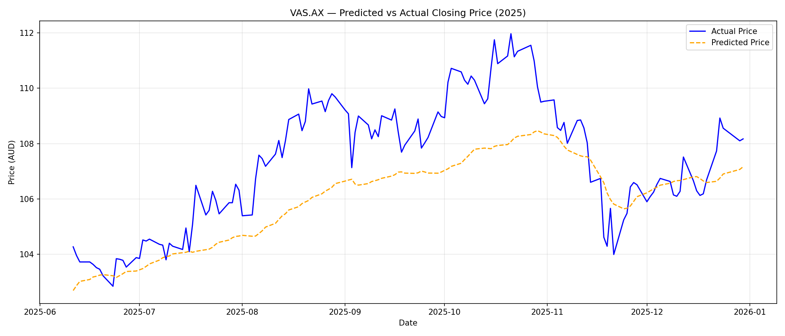
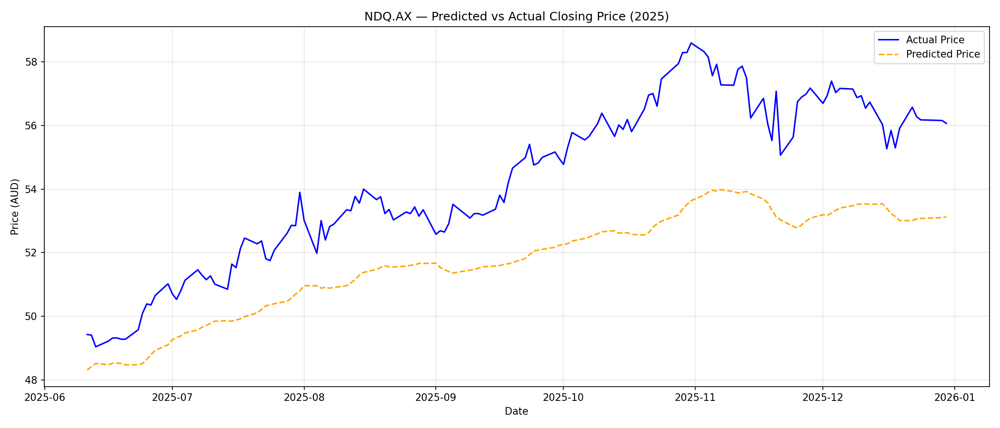
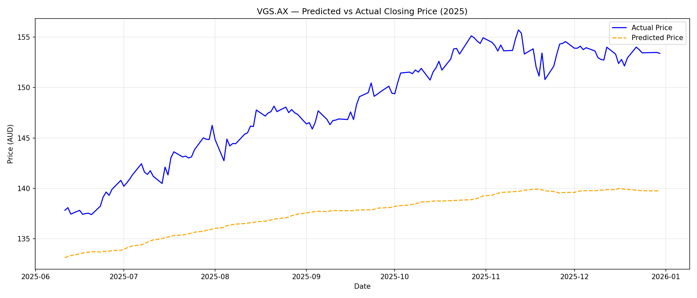

# **STOCK PRICE PREDICTOR PROJECT**

## Project Overview
THis is a ML Project that I have created based on my recent peak in interest in investing and index funds. This models predicys the closing prices of four ASX-listed ETF's using an LSTM neural network, technical indicators and others correlating macroeconomic factors. This model is trained on post-COVID market data (January 2022 -December 2024) and does not include data prior to that as the conditions during COVID led to extreme price volatility which wasnt a proper indicator of everyday market performance and the data is then tested against real 2025 prices to evaluate prediction accuracy. 

## Project Aim
The aim of this project is to demonstrate a rigorous end-to-end ML pipeline with proper evaluation. 

## Project Structure
```
StockPricePredictor_Project/
│
├── data_loader.py       # Downloads and cleans stock + macro data from Yahoo Finance
├── features.py          # Engineers technical indicators from raw price data
├── model.py             # Builds and trains the LSTM neural network
├── evaluate.py          # Measures prediction accuracy against real 2025 prices
├── app.py               # Streamlit dashboard tying everything together
├── requirements.txt     # All dependencies needed to run the project
└── README.md            # You are here
```

## ETF's Analysed
I chose the ETF's that were analysed in this project as I had a personal interest in investing in these specific hedge funds. The ETFs include:

| Ticker | Name | What it comprises |
|--------|------|-------------------|
| IVV.AX | iShares S&P 500 ETF | Top 500 US companies, AUD denominated |
| VAS.AX | Vanguard Australian Shares | Top 300 ASX companies |
| VGS.AX | Vanguard Global Shares | Global developed markets ex-Australia |
| NDQ.AX | BetaShares Nasdaq 100 | Top 100 US tech stocks, AUD denominated |

## Comparitive Macroeconomics Factors Used

I chose these specific macro features as they directly influence the broad market ETF's. 

| Ticker | What it represents | Why it matters |
|--------|--------------------|----------------|
| ^VIX | CBOE Volatility Index | Market fear gauge — spikes when investors are uncertain |
| ^TNX | 10-Year US Treasury Yield | Rising yields historically pressure equity prices |
| GLD | Gold ETF price | Safe-haven flows often move inverse to equities |
| ^GSPC | S&P 500 Index | Direct benchmark for IVV.AX and NDQ.AX |
| AUDUSD=X | AUD/USD Exchange Rate | Currency movements directly affect AUD-denominated ETFs |

## Data

**Source:** Yahoo Finance via the yfinance Python library

**Training data:** January 2022 – December 2024 (post-COVID market conditions)

**Test data:** January 2025 – December 2025 (unseen real prices used to evaluate accuracy)

**Raw features:** Open, High, Low, Close, Volume (OHLCV)

**Engineered features:**

All the features included are calcualted from raw OHLCV (Open, High, Low, Close, Volume) before being fed into the model. 

| Feature | What it measures |
|---------|-----------------|
| MA20 | 20-day moving average — short term price trend |
| MA50 | 50-day moving average — longer term price trend |
| Daily Return | Percentage price change from previous day |
| Volume Delta | Percentage change in trading volume from previous day |
| RSI | Relative Strength Index — overbought/oversold momentum signal (0–100) |
| MACD | Moving Average Convergence Divergence — trend momentum signal |
| MACD Signal | 9-day average of MACD — used to detect momentum shifts |

### Why These Features

Raw closing prices alone are not enough for the model to learn from. These indicators encode:
- **Trend** — where the price has been heading (MA20, MA50)
- **Momentum** — how fast it is moving and in which direction (MACD, RSI)
- **Conviction** — whether moves are backed by real trading activity (Volume Delta)
- **Normalisation** — relative change rather than absolute price levels (Daily Return)

## Model Architecture 

### What is a Neural Network?
A neural network is a model that identifies patterns from historical data without being explicitly programmed with rules. Instead of telling it "when RSI is above 70, the price will drop", we feed it thousands of examples and let it figure out the patterns itself. However a regular neural network treats each day's data as completely independent with no awareness that yesterday came before today.

### Why LSTM?
LSTM stands for Long Short-Term Memory. Unlike a regular neural network, an LSTM was specifically designed to maintain memory across a sequence of inputs.  making it ideal for time series data like stock prices where patterns play out over days, weeks and months, not just single days. A practical example: when the 20-day moving average crosses above the 50-day moving average, that has historically been a bullish signal. But to identify that pattern, the model needs memory backdated by months, a regular neural network cannot do this.

### How LSTM Memory Works
An LSTM has two types of memory:

- **Cell State (long-term memory)** — stores information from past days. Data can be added or removed as the model processes each day in the sequence
- **Hidden State (short-term memory)** — a summary of what happened recently, passed forward to the next step

These are controlled by three gates the model learns during training:

| Gate | Job |
|------|-----|
| Forget gate | Decides what old information to discard |
| Input gate | Decides what new information is worth storing |
| Output gate | Decides what to pass forward to the next layer |

### Why Two LSTM Layers?
The first layer with 128 units learns low-level patterns such as short term price movements and momentum shifts. The second layer with 64 units takes that output and learns higher-level patterns, longer term trends and relationships between features. Stacking layers gives the model more capacity without needing a single massive layer.

### Overfitting Prevention
Two strategies are used to prevent the model memorising training data:

- **Dropout (20%)** — randomly switches off 20% of neurons during each training step, forcing the model to learn robust patterns rather than memorising specific sequences
- **Chronological train/validation split** — 90% of sequences used for training, last 10% for validation. Never shuffled — splitting randomly would cause data leakage by training on future data

### Known Limitations

- The model does not capture event-driven shocks such as Federal Reserve announcements, geopolitical events, or earnings surprises
- Macroeconomic data such as CPI and unemployment figures are monthly and not included due to date alignment complexity
- No model can reliably predict stock prices, this project demonstrates a rigorous ML pipeline, not a trading strategy

## Evaluation

This is where we find out if the model actually worked. The trained model is loaded, fed real 2025 price data it has never seen before, and its predictions are compared against what actually happened in the market.

### Evaluation Pipeline

1. Load the trained LSTM model and scaler saved from model.py
2. Download real 2025 market data for each ETF
3. Engineer the same features using features.py
4. Scale the 2025 data using the scaler fitted on 2022–2024 training data
5. Build 60-day sequences the same way as training
6. Feed sequences through the model to generate predictions
7. Inverse transform predictions back to real AUD prices
8. Measure accuracy against real 2025 closing prices
9. Plot predicted vs actual prices on a chart

### Why I Use the Training Scaler on 2025 Data
The scaler was fitted on 2022–2024 data and learned the minimum and maximum value of each feature during that period. When transforming 2025 data we apply that same scaler 
rather than fitting a new one. If we refitted the scaler on 2025 data it would learn different min/max values and all predictions would be meaningless. Consistency between 
training and prediction is critical.

### Accuracy Metrics

| Metric | Full name | What it means |
|--------|-----------|---------------|
| MAE | Mean Absolute Error | Average dollar difference between predicted and actual price |
| RMSE | Root Mean Squared Error | Like MAE but penalises large errors more heavily |
| MAPE | Mean Absolute Percentage Error | Average percentage difference — the most intuitive metric |

MAPE is the headline metric. A MAPE of 3% means the model's predictions were on average 3% away from the real price across all of 2025.

### Chart Analysis

**IVV.AX — 2.00% MAPE (Best performer)**
The model correctly identified the upward trend from $61 to $68 across 2025. The predicted line tracks the general direction well but is smoother than reality,  the model learned the macro trend but underestimated day-to-day volatility. This is expected LSTM behaviour during a strong sustained bull run.

**VAS.AX — 3.42% MAPE**
Good trend direction captured,  the model correctly predicted a rising then stabilising pattern across 2025. The gap between predicted and actual widens in Q3/Q4 as VAS.AX experienced stronger moves than the training period suggested.

**NDQ.AX — 6.89% MAPE (Weakest performer)**
The model correctly identified the upward trend direction but consistently underestimated the magnitude of price rises. NDQ.AX tracks US tech stocks which experienced stronger than expected gains in 2025 — a pattern not well represented in the 2022-2024 training data which included the 2022 tech selloff.

**VGS.AX — 4.82% MAPE**
Similar pattern to IVV.AX — trend direction correct, magnitude underestimated. VGS.AX has a large US equity weighting which drove stronger gains than the model anticipated based on its post-COVID training window.

### Key Observation Across All Four ETFs
All four models correctly predicted the **direction** of price movement in 2025 — an upward trend across the board. The consistent gap between predicted and actual prices reflects a known limitation: the model was trained on 2022-2024 data which included significant volatility and drawdowns, so it conservatively underestimates the magnitude of a sustained bull market in 2025. This is a feature of the training window choice, not a flaw in the model architecture.

### Prediction Plots





## Author
Riyansh Ritesh Adiyeri
Macquarie University — Bachelor of Commerce / Information Technology
Major: International Business & Cyber Security